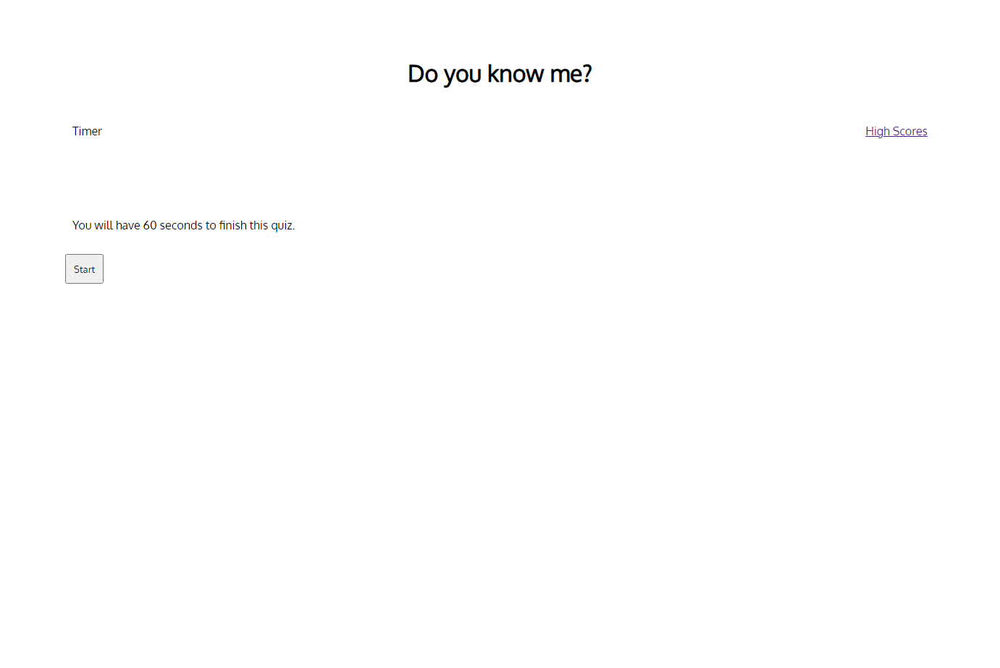

## Quiz

# Description

The goal of this web application was to create a quiz. The quiz ends when the user has answered all the questions or the timer has run out. THis project incorporated many differnt aspects of JavaScript.

# Technologies Used

* HTML
* CSS
* JavaScript

# Links

[Repository](https://github.com/n810tran/my-quiz)

[Deployed Site](https://n810tran.github.io/my-quiz/)

# Preview

